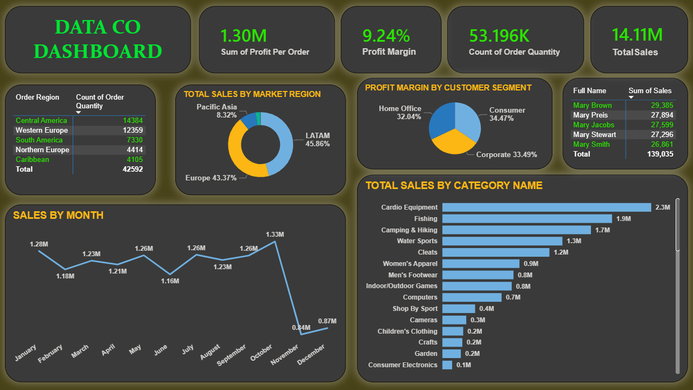

# 📊 Data Co Supply Chain Analysis Dashboard

## Power BI Project

## 📄 Overview
This project analyzes comprehensive supply chain and sales data for **Data Co**, focusing on profit margins, regional performance, and sales trends across different product categories and time periods.

## 🖼️ Dashboard Preview

## 🔑 Key Metrics
* **Total Profit Per Order:** 1.30M
* **Average Profit Margin:** 9.24%
* **Total Order Quantity:** 53.196K

## 🚀 Main Insights

* **🌍 Market Performance:** The **LATAM** region leads in profit margin at **45.86%**, closely followed by **Europe** at **43.37%**.
  
* **📈 Sales Trends:** Sales reached a peak in **October (1.33M)**, showing strong seasonal demand towards the end of the year.

* **🛍️ Customer Segments:** The **Consumer segment** is the primary driver of profitability, accounting for **34.47%** of the total profit margin.

* **📦 Product Categories:** **Cardio Equipment** and **Fishing** are the top-performing categories in terms of sales volume.

## 🛠️ Tools Used
* **Power BI:** Data Visualization & Dashboarding.
* **Power Query:** Data Cleaning & Transformation (ETL).
* **DAX:** Advanced Calculations & Measures.
*
